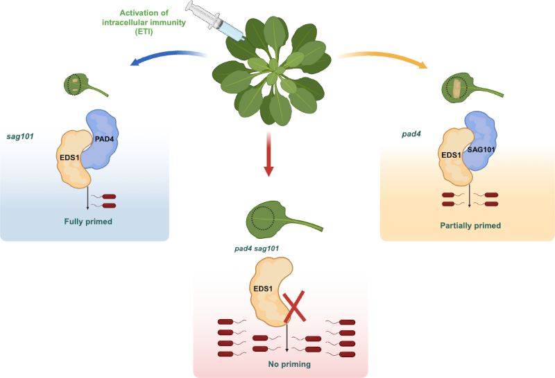

# Github Repository: Modular mechanisms of immune priming and growth inhibition mediated by plant effector-triggered immunity!

The code used in the publication: "Modular mechanisms of immune priming and growth inhibition mediated by plant effector-triggered immunity!" (DOI: NA) is stored here.
