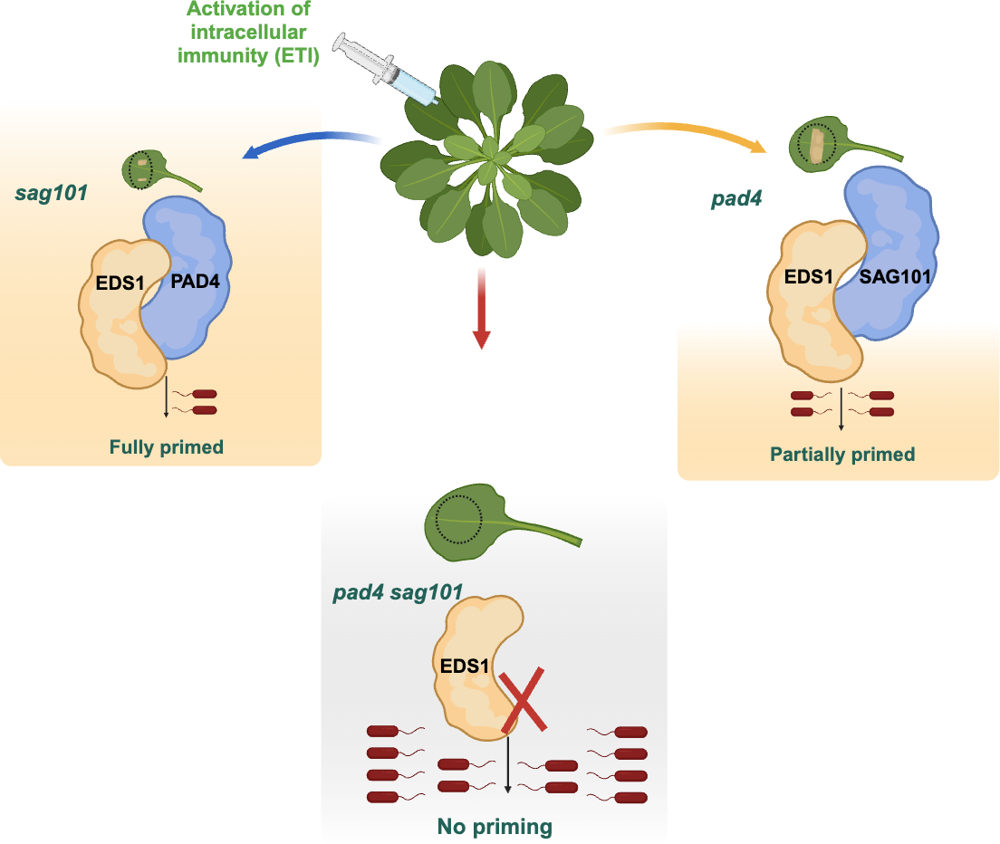

# Github Repository: Modular mechanisms of immune priming and growth inhibition mediated by plant effector-triggered immunity!

    

The code used in the publication **"Modular mechanisms of immune priming and growth inhibition mediated by plant effector-triggered immunity"** DOI: [https://doi.org/10.1101/2024.02.01.578334](https://doi.org/10.1101/2024.02.01.578334) is stored in this repository. All figures were generated in R using R Markdown.
Each folder contains the R markdown file and a corresponding HTML document with detailed instructions for generating the figures included in the publication. Additionally, all necessary data files for figure generation are provided as .csv files within the Data folder.
The libraries used in this publication can be found in the 'Used_libraries.csv' file.

